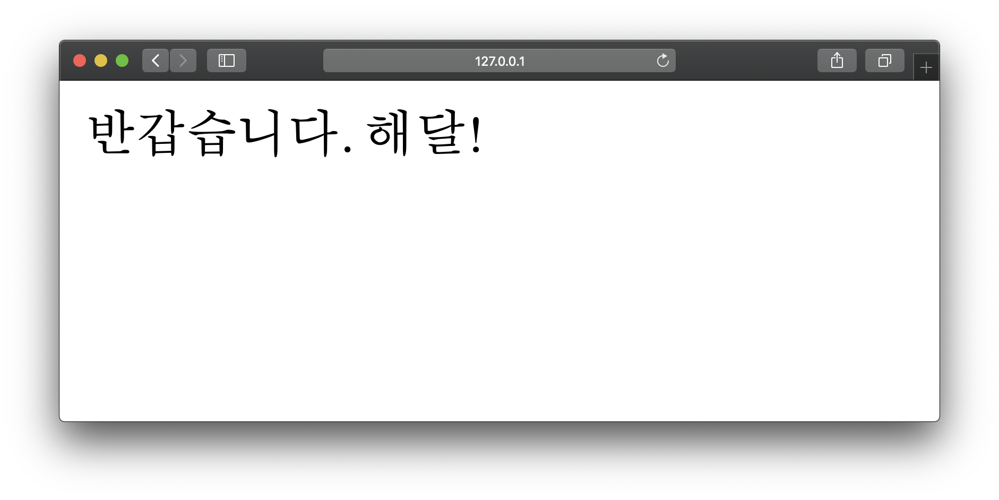
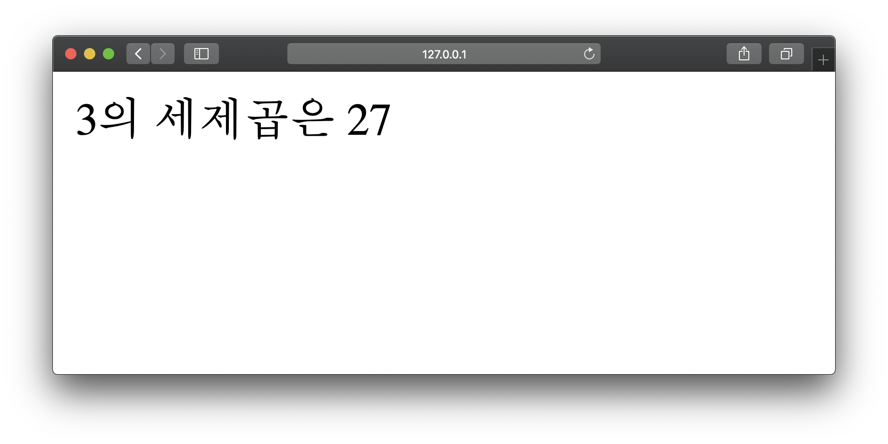

# 점심 뭐 먹지?
> 파이썬을 활용해 일상에서 쓸 수 있을 프로젝트를 만듭니다

## `Flask`로 간단한 웹서버 키자

파이참 프로젝트를 실행하고 `Flask`를 다운로드 합니다
```bash
$ pip3 install Flask
``` 

점심을 뭐먹을 건지 확인하고 싶으므로,  
`mylunch.py`라는 이름의 파이썬 파일을 만듭니다. 
```bash
$ touch mylunch.py
``` 

`mylunch.py`를 통해 서버를 켜보자  
```python
from flask import Flask
app = Flask(__name__)

@app.route("/")
def hello():
    return "Hello World!"
```

```bash
$ FLASK_APP=mylunch.py flask run
```

서버가 잘 켜지나요?


`FLASK_APP=mylunch.py flask run` 명령어는 `mylunch.py` 파일을  
수정할때마다 서버를 껐다 켜야합니다.  
서버를 켜두고 작업하다 수정할때마다 디버그를 할 수 있게 하여   
새로고침할 때 마다 수정사항을 반영합니다 

```bash
$ FLASK_DEBUG=1 FLASK_APP=mylunch.py flask run
```
[`http://127.0.0.1:5000/haedal`](http://127.0.0.0:5000/haedal)을 만들어 봅니다 

```python
from flask import Flask
app = Flask(__name__)

@app.route("/")
def hello():
    return "Hello World!"

@app.route("/haedal")
def haedal():
    return "This is Haedal"
```
새로고침하니 수정사항이 반영되나요?


서버를 킬때마다 `$ FLASK_DEBUG=1 FLASK_APP=mylunch.py flask run` 명령어를 쳐야하면 일이 많겠죠?  
파이썬 파일이니 `python3 mylunch.py`으로 실행 가능하도록  
명령어를 줄여봅니다

```python
from flask import Flask
app = Flask(__name__)

@app.route("/")
def hello():
    return "Hello World!"

@app.route("/haedal")
def haedal():
    return "This is Haedal"

# Flask를 쉽게 켜자
if __name__ == '__main__':
  app.run(debug=True)
```

```bash
$ python3 mylunch.py
```

## 점심 먹기 전 몇가지 더 해보자
인사하고, 간단한 수학 연산 해봅니다

`url`을 통해 자기이름을 넘겨 인사합니다  
`<string:name>` 구문을 통해 문자열을 넘깁니다
```python
@app.route("/greeting/<string:name>")
def greeting(name):
  return f'반갑습니다. {name}!'
```
위의 코드를 `mylunch.py`에 삽입합니다  
서버를 키고 [127.0.0.1:5000/greeting/자기이름](http://127.0.0.1:5000/greeting/자기이름)으로 가봅니다



대수학과 산술학에서 `cube`는 세제곱을 의미합니다.  
자기이름과 동일하게 `url`을 통해 숫자를 넘겨 계산합니다
`<int:num>` 구문을 통해 숫자를 넘깁니다

```python
@app.route("/cube/<int:num>")
def cube(num):
  result = num ** 3 
  return f'{num}의 세제곱은 {result}'
```
위의 코드를 `mylunch.py`에 삽입합니다   
서버를 키고 [127.0.0.1:5000/cube/숫자](http://127.0.0.1:5000/cube/숫자)로 가봅니다



사람 수 만큼 점심 메뉴를 추천합니다  
파이썬  `random` 라이브러리의 `sample`함수를 사용해봅니다  
  
```python
from random import sample

# 사람 수 만큼 점심 메뉴 추천
@app.route("/lunch/<int:people>")
def lunch(people):
  menu = ["짜장면", "짬뽕", "라면", "브리또", "사과", "찜닭"]
  return f'{sample(menu, people)}'
```

위의 코드를 `mylunch.py`에 삽입합니다   
서버를 키고 [127.0.0.1:5000/cube/숫자](http://127.0.0.1:5000/cube/숫자)로 가봅니다
